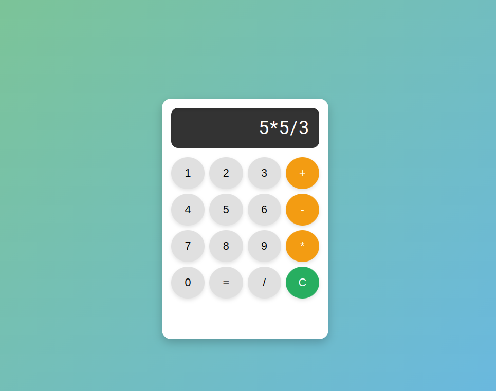

# React Calculator

A simple, mobile-friendly calculator built using React, designed to perform basic arithmetic operations. The app is styled like a typical mobile calculator and works responsively across different screen sizes.

## Features

- Perform basic operations: Add, Subtract, Multiply, Divide
- Clear (reset) button to start a new calculation
- Equals button to evaluate expressions
- Responsive design with interactive buttons and hover effects
- Styled to resemble a mobile calculator

## Screenshots

### Mobile Calculator View


### Desktop View




## Installation

To run this project locally, follow the steps below:

1. Clone the repository:

   ```bash
   git clone https://github.com/bhav380-2/ReactSkillTest-CalculatorProject.git

2. Navigate to the project directory:

   ```bash
   cd react-calculator

3. Install dependencies:

   ```bash
   npm install

4. Start the development server:
   ```bash
   npm start

The app will be available at http://localhost:3000.

## Usage

- Click on the number buttons to enter digits.
- Use the `+`, `-`, `*`, and `/` buttons to perform arithmetic operations.
- Click `=` to evaluate the result.
- Use the `C` button to clear the input and reset the calculator.

## Hosted Link 
https://bhav380-2.github.io/ReactSkillTest-CalculatorProject/

## Technologies Used

- **React**: Frontend library used to build the calculator.
- **CSS Grid & Flexbox**: For responsive and modern layout.
- **JavaScript**: To handle calculator logic.

## Future Improvements

- Add support for more advanced operations like percentage, square root, etc.
- Include a theme switcher for dark and light modes.
- Add keyboard support for faster input.

